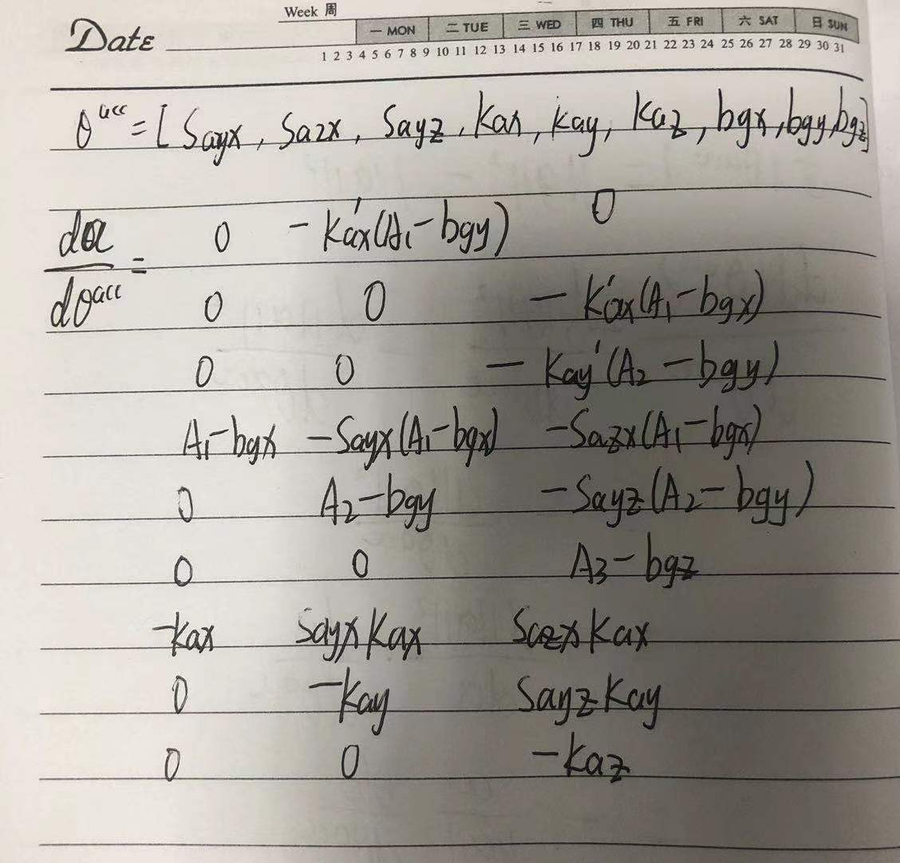
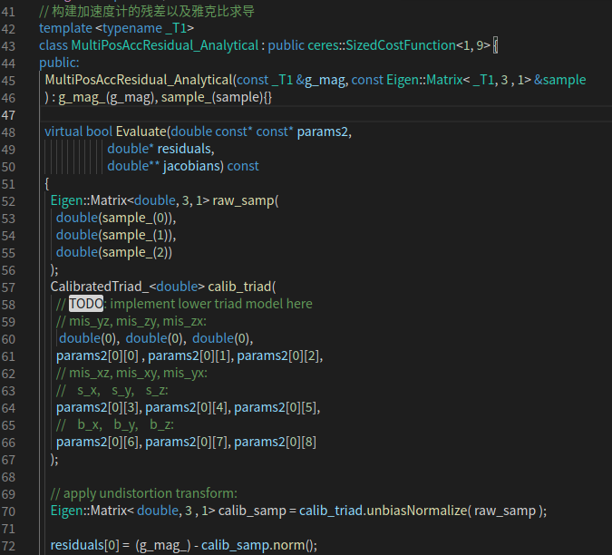
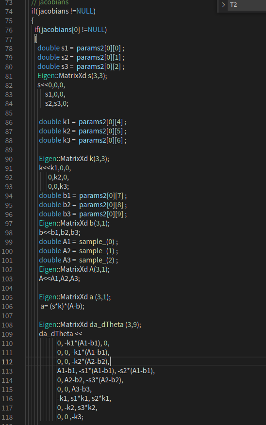
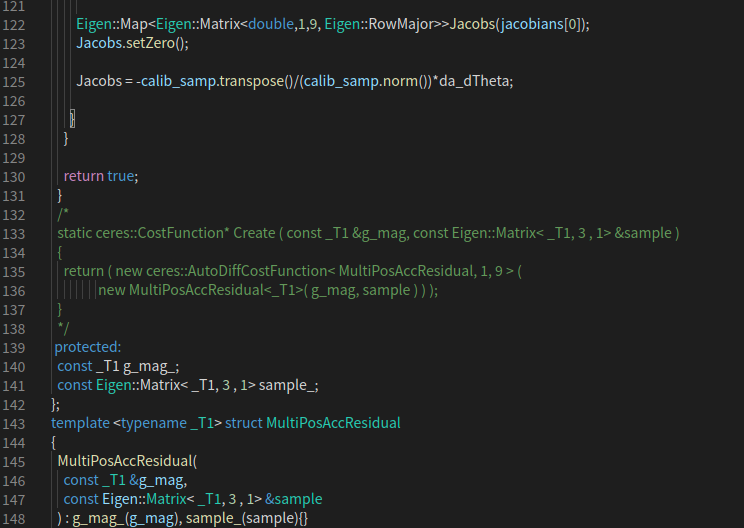
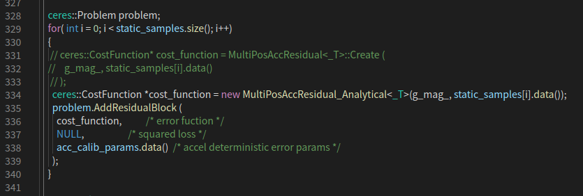
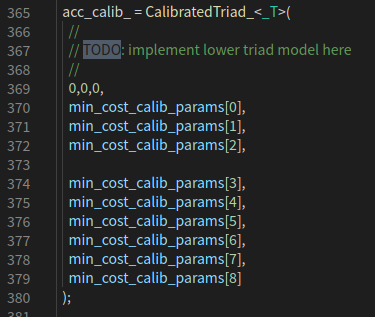
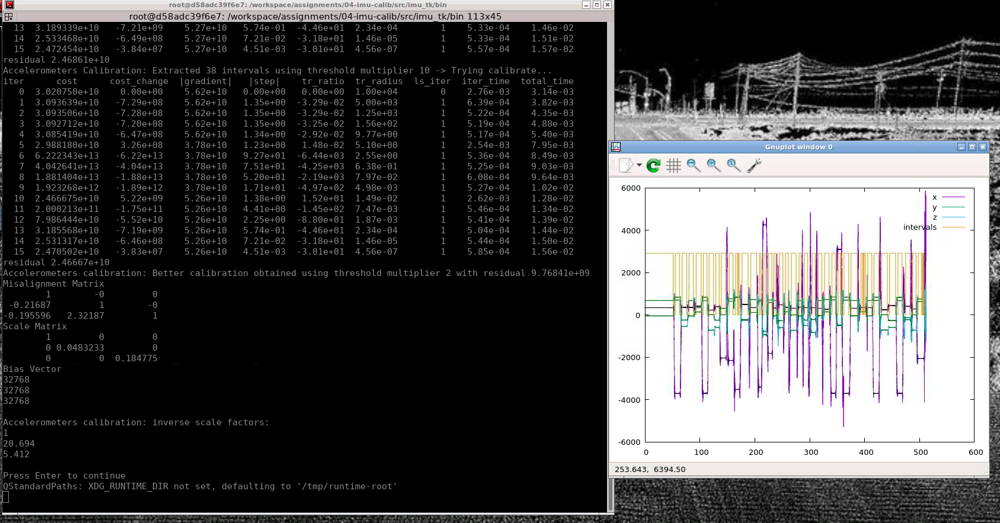

# 第五章作业

深蓝学院, 多传感器融合定位与建图, 基于第5章IMU Calib代码框架.

## Overview

本作业旨在加深对不依赖转台的标定方法的理解.

## 内容

1. ### 雅克比推导

   

   

   

2. ### 解析式求导

   2.1构建参数矩阵以及残差函数

2.2 解析式的雅克比求导

2.3更新CostFunction

 

2.4 构建下三角矩阵

## 3.运行程序结果

