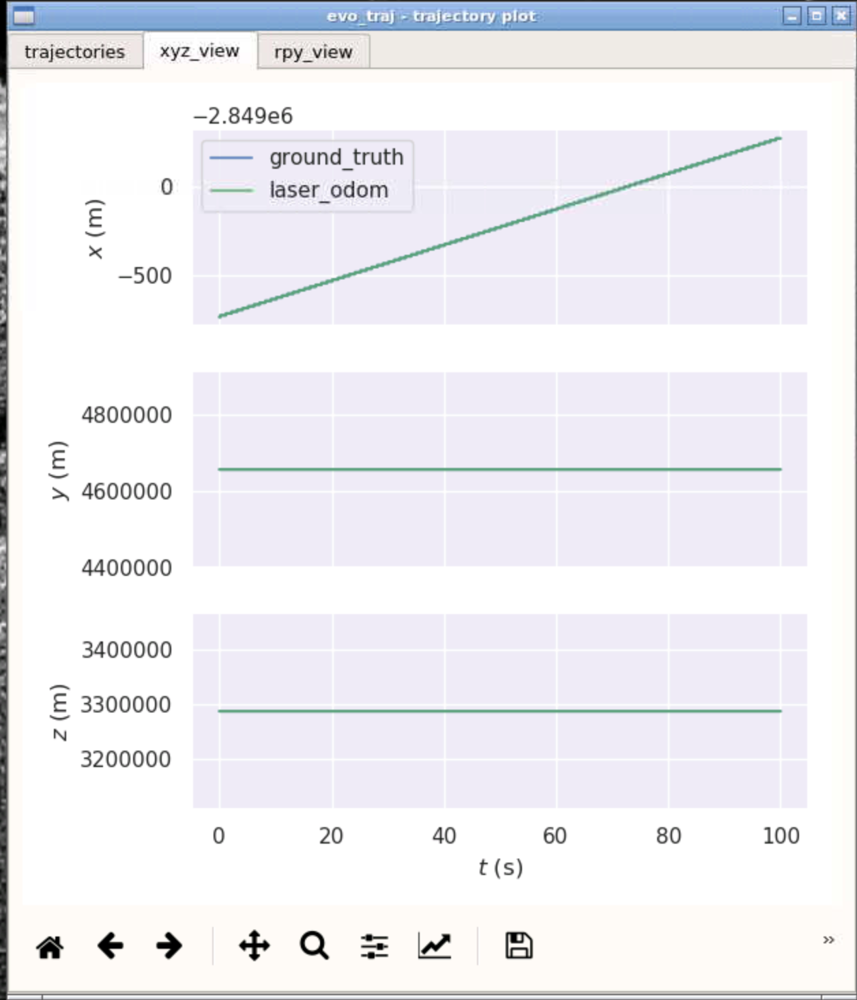

# Sensor Fusion: Lidar Odometry -- 多传感器融合定位与建图: 惯性导航原理

深蓝学院, 多传感器融合定位与建图, 第6章IMU Navigation代码框架.

## Overview

本作业旨在加深对**惯性导航解算**的理解.

本次作业写了很长时间，但是收货也是最大的，感觉通过这次作业把前面的好几章学过的内容都串了起来，以前只是知识点，现在成了线和面，收货很大。

用于误差评价数据的保存参考了第二章的作业，数据的生成参考了作业中的数据生成格式。还有一个小遗憾就是误差评价的数据ground_truth的显示或者加载有点问题，后期有时间再改进一下。

关于作业的代码填写如下：


```bash
// get deltas:
        const size_t index_curr = 1;
        const size_t index_prev = 0;
        Eigen::Vector3d angular_delta;
        Eigen::Matrix3d R_curr;
       Eigen::Matrix3d R_prev;
        Eigen::Vector3d velocity_delta;
        double delta_t;


        GetAngularDelta( index_curr, index_prev,angular_delta);

        // update orientation:

        // get velocity delta:
        GetVelocityDelta( index_curr, index_prev,R_curr, R_prev, delta_t, velocity_delta);

         UpdateOrientation(angular_delta,R_curr, R_prev);

        // update position:
        UpdatePosition(delta_t,velocity_delta );

        // move forward -- 
        
        // NOTE: this is NOT fixed. you should update your buffer according to the method of your choice:
        imu_data_buff_.pop_front();
```

```bash
    #分别算了中值法和欧拉法
    Eigen::Vector3d angular_vel_curr = GetUnbiasedAngularVel(imu_data_curr.angular_velocity);
    Eigen::Vector3d angular_vel_prev = GetUnbiasedAngularVel(imu_data_prev.angular_velocity);
   #基于中值法
     angular_delta = 0.5*delta_t*(angular_vel_curr + angular_vel_prev);
    #基于欧拉法
      angular_delta = delta_t*angular_vel_prev;

    return true;
```

分别算了中值法和欧拉法得出的结果：

中值法：


欧拉法：


精度分析对比：参考第二章的误差评价程序修改而来。

中值法


欧拉法


### 自己建立仿真数据


结果分析

全部数据用中值法估算位姿


误差分析


欧拉法位姿估算

全程


误差分析


## 分段统计

### 静止状态

#### 中值法


#### 欧拉法


### 匀速状态

#### 中值法


#### 欧拉法




### 加速状态（0.2m2/s）

#### 中值法


#### 欧拉法


### 减速状态（-0.3m2/s）

#### 中值法


#### 欧拉法


### 转弯状态

#### 中值法


#### 欧拉法


### 结论与分析：

首先，好像有什么问题导致ground_truth的线没有显示出来或者是被重合了，如果单看laser_odom的绿线的话，基本上中值法和欧拉法差别不大，但是减速状态欧拉法比中值法好一些，转弯状态中值法要好于欧拉法，匀速，静止都差不多。从全程的数据来看，中值法的误差要比欧拉法好，中值法的误差最大值和均值都比欧拉法小，这也与实际的感受一致。