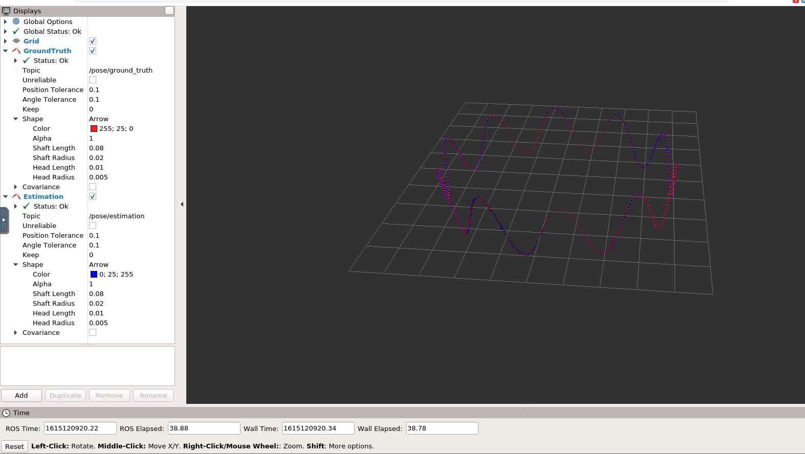
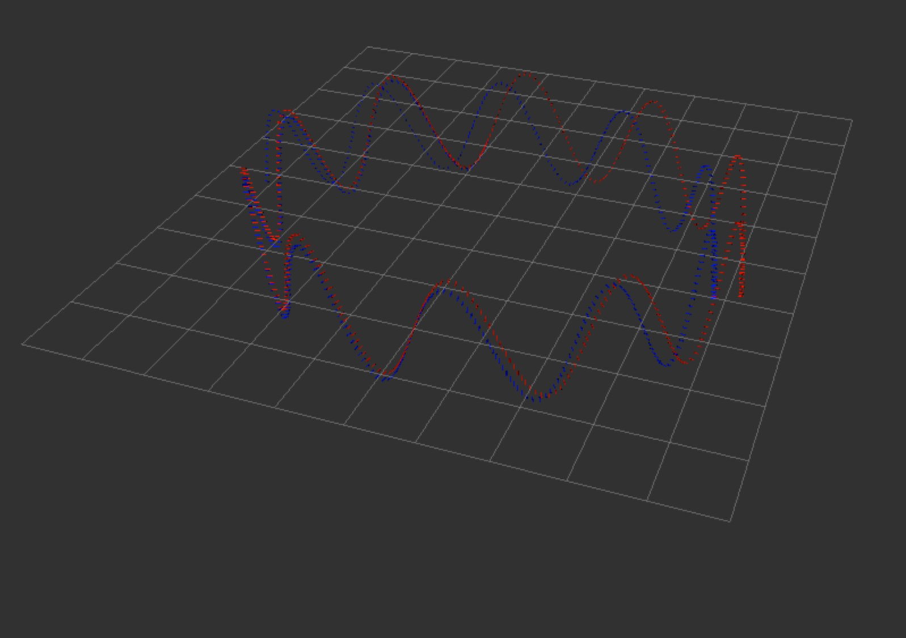
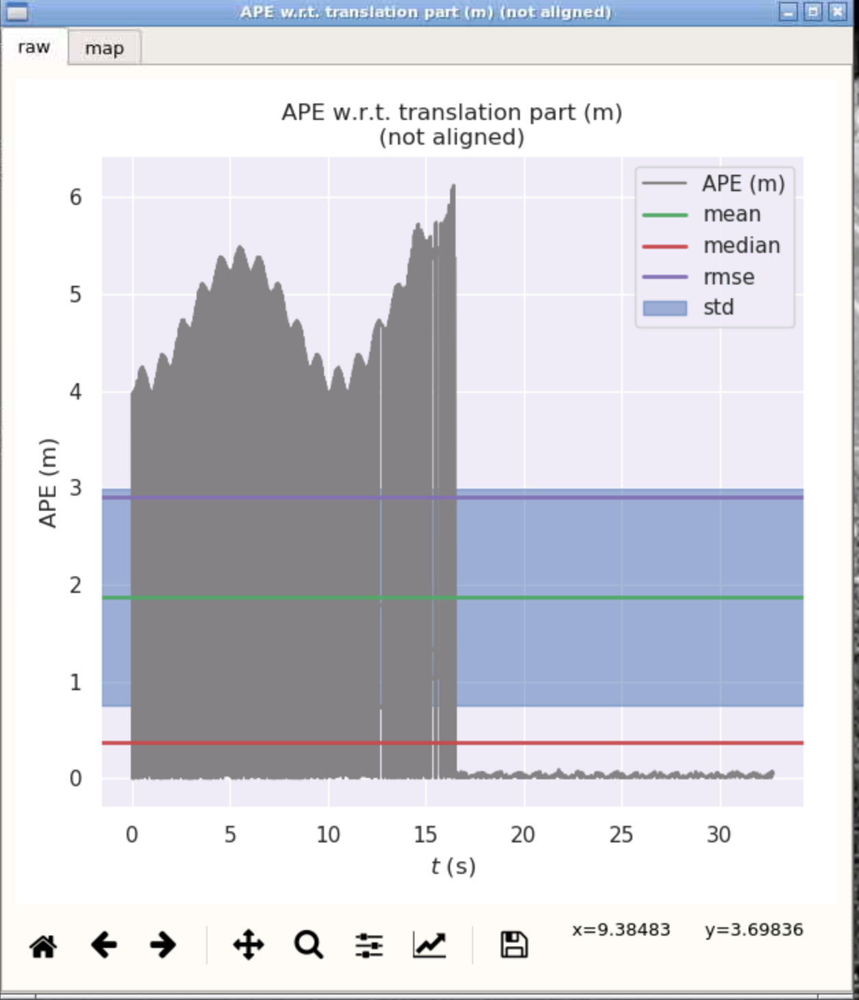
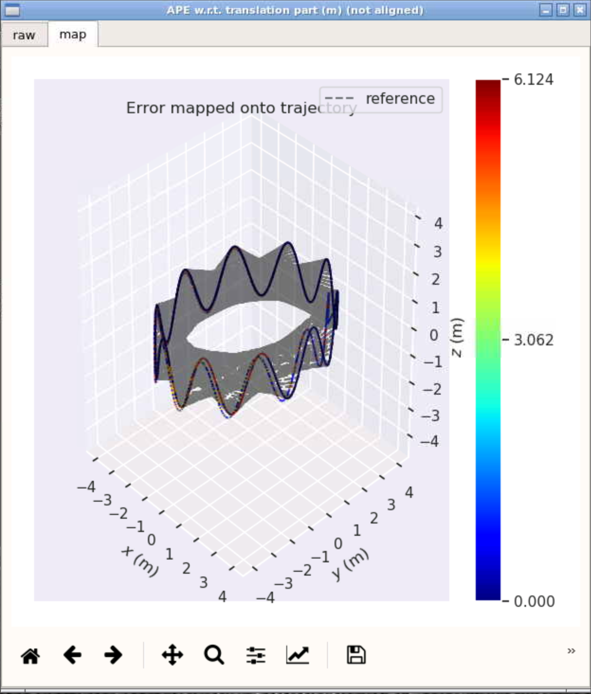
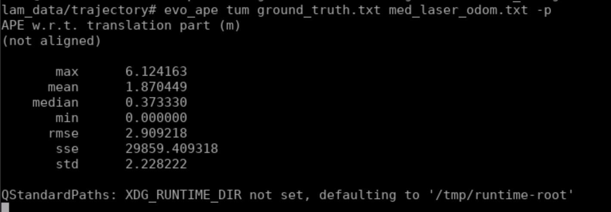
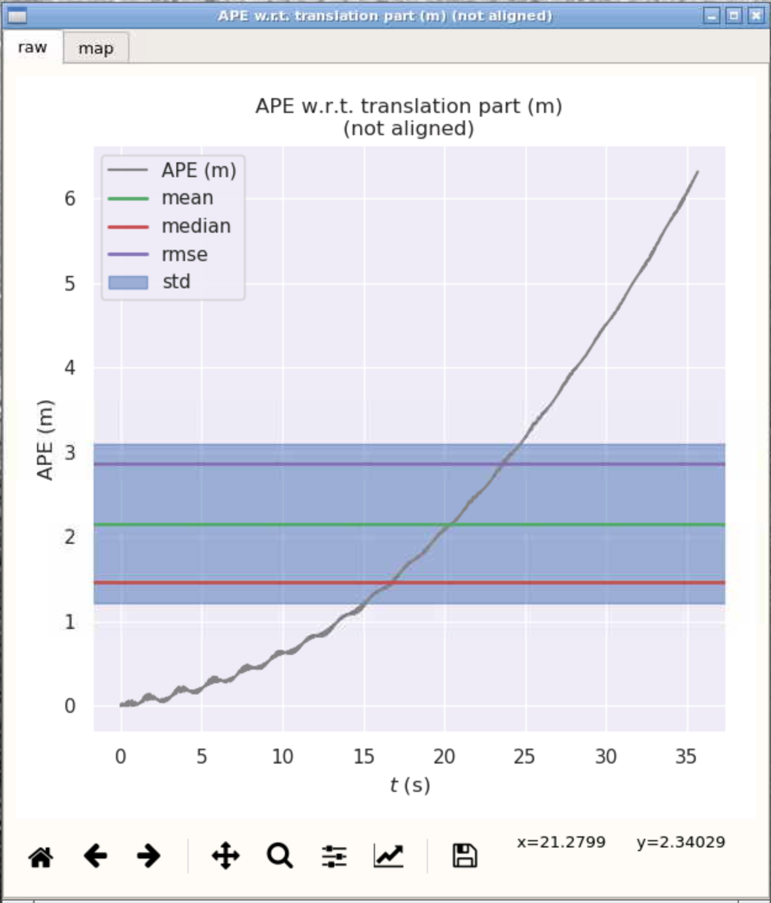
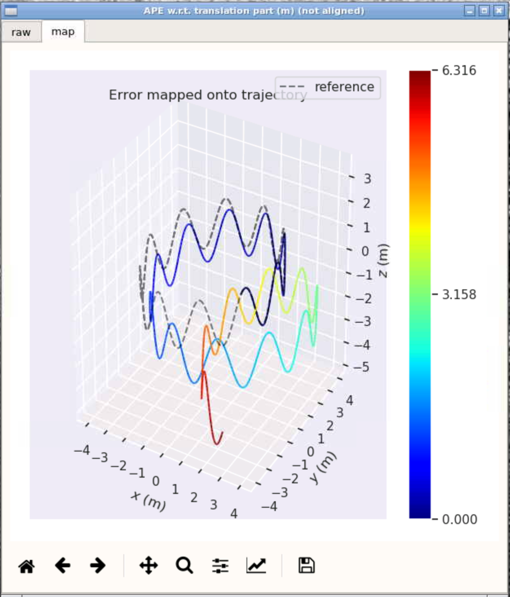
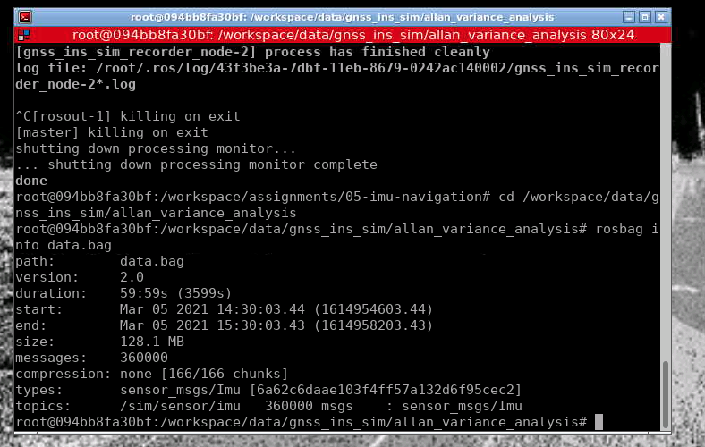
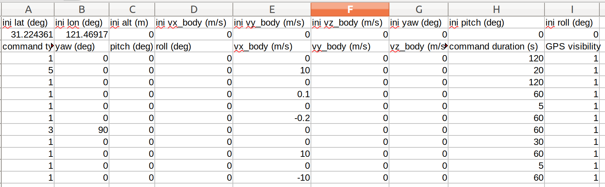

# Sensor Fusion: Lidar Odometry -- 多传感器融合定位与建图: 惯性导航原理

深蓝学院, 多传感器融合定位与建图, 第6章IMU Navigation代码框架.

## Overview

本作业旨在加深对**惯性导航解算**的理解.

关于作业的代码填写如下：


```bash
// get deltas:
        const size_t index_curr = 1;
        const size_t index_prev = 0;
        Eigen::Vector3d angular_delta;
        Eigen::Matrix3d R_curr;
       Eigen::Matrix3d R_prev;
        Eigen::Vector3d velocity_delta;
        double delta_t;


        GetAngularDelta( index_curr, index_prev,angular_delta);

        // update orientation:

        // get velocity delta:
        GetVelocityDelta( index_curr, index_prev,R_curr, R_prev, delta_t, velocity_delta);

         UpdateOrientation(angular_delta,R_curr, R_prev);

        // update position:
        UpdatePosition(delta_t,velocity_delta );

        // move forward -- 
        
        // NOTE: this is NOT fixed. you should update your buffer according to the method of your choice:
        imu_data_buff_.pop_front();
```

```bash
    #分别算了中值法和欧拉法
    Eigen::Vector3d angular_vel_curr = GetUnbiasedAngularVel(imu_data_curr.angular_velocity);
    Eigen::Vector3d angular_vel_prev = GetUnbiasedAngularVel(imu_data_prev.angular_velocity);
   #基于中值法
     angular_delta = 0.5*delta_t*(angular_vel_curr + angular_vel_prev);
    #基于欧拉法
      angular_delta = delta_t*angular_vel_prev;

    return true;
```

分别算了中值法和欧拉法得出的结果：

中值法：



欧拉法：



精度分析对比：参考第二章的误差评价程序修改而来。

中值法







欧拉法







### 自己建立仿真数据



结果分析

待更新...