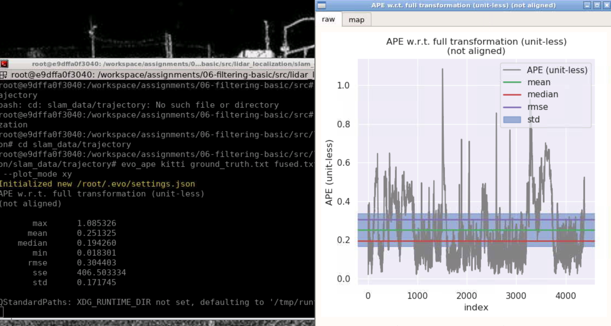

# Sensor Fusion: Lidar Odometry -- 多传感器融合定位与建图: 基于滤波的融合方法I

深蓝学院, 多传感器融合定位与建图, 第7章Filtering Basic代码框架.

---

## Overview

本作业旨在加深对**基于滤波的融合方法**的理解.

代码填充

```bash
//
  // TODO: perform Kalman prediction
  //
  X_ = F*X_ ;                                           // fix this   + B*w_b
  P_ =F* P_*F.transpose() + B*Q_*B .transpose() ; // fix this
}

/**
 * @brief  correct error estimation using pose measurement
 * @param  T_nb, input pose measurement
 * @return void
 */
void ErrorStateKalmanFilter::CorrectErrorEstimationPose(
    const Eigen::Matrix4d &T_nb, Eigen::VectorXd &Y, Eigen::MatrixXd &G,
                 Eigen::MatrixXd &K) {
  //
  // TODO: set measurement:
  //这是观测方程的参数
  //下面的更新有问题
  //Eigen::Matrix4f &pose;
  Eigen::Vector3d P_nn_obs =  pose_.block<3, 1>(0, 3) - T_nb.block<3, 1>(0, 3); // fix this
  Eigen::Matrix3d R_nn_obs =   T_nb.block<3, 3>(0,0) .transpose() * pose_.block<3, 3>(0, 0) ;//* ); // fix this


  YPose_.block<3, 1>(0, 0) = P_nn_obs;
  YPose_.block<3, 1>(3, 0) =  Sophus::SO3d::vee (R_nn_obs -Eigen:: Matrix3d::Identity() );//).transpose() ;
//pose_.block<3, 1>(0, 3);    vee为 反对称矩阵 到 向量  相当于下尖尖运算 
  Y = YPose_;

  // set measurement equation:
  G = GPose_;
  //C = CPose_;

  //有观测量时的更新
  // TODO: set Kalman gain:
  //
  MatrixRPose R = GPose_*P_*GPose_.transpose() + RPose_;// fix this  GPose_*P_*GPose_.transpose() +
  K =  P_ * G .transpose()*(G *P_ * G .transpose() + R ).inverse();                 // fix this
  
}

/**
 * @brief  correct error estimation
 * @param  measurement_type, measurement type
 * @param  measurement, input measurement
 * @return void
 */
void ErrorStateKalmanFilter::CorrectErrorEstimation(
    const MeasurementType &measurement_type, const Measurement &measurement) {
  //
  // TODO: understand ESKF correct workflow
  //
  Eigen::VectorXd Y;
  Eigen::MatrixXd G, K;
  switch (measurement_type) {
  case MeasurementType::POSE:
    CorrectErrorEstimationPose(measurement.T_nb, Y, G, K);
    break;
  default:
    break;
  }

  //
  // TODO: perform Kalman correct:
  //

  P_ =  (MatrixP::Identity() - K*G)*P_ ; // fix this
  X_ = X_+ K*(Y - G * X_);              // fix this
}

/**
 * @brief  eliminate error
 * @param  void
 * @return void
 */
void ErrorStateKalmanFilter::EliminateError(void) {
  //
  // TODO: correct state estimation using the state of ESKF
  //
  // a. position:
  pose_.block<3, 1>(0, 3) -= X_.block<3, 1>(INDEX_ERROR_POS, 0); // fix this
          
  // b. velocity:
  vel_ -= X_.block<3, 1>(INDEX_ERROR_VEL, 0);; // fix this
  // c. orientation:
  Eigen::Matrix3d C_nn = Eigen::Matrix3d::Identity() -
      Sophus::SO3d::hat(X_.block<3, 1>(INDEX_ERROR_ORI, 0)).matrix();
  pose_.block<3, 3>(0, 0) = pose_.block<3, 3>(0, 0) *C_nn ; // fix this

  // d. gyro bias:
  if (IsCovStable(INDEX_ERROR_GYRO)) {
    gyro_bias_ -= X_.block<3, 1>(INDEX_ERROR_GYRO, 0);
  }

  // e. accel bias:
  if (IsCovStable(INDEX_ERROR_ACCEL)) {
    accl_bias_ -= X_.block<3, 1>(INDEX_ERROR_ACCEL, 0);
  }
}
```

## 运行结果

* **黄色**轨迹为**GNSS Localization**, 此处用作**Ground Truth**

* **蓝色**轨迹为**ESKF Fused Estimation**


### 误差分析

#### Laser与Ground Truth的轨迹方差等偏离数据数据：


除了个别转弯的地方偏离的数值会突然增大，其他地方基本处于均值附近

#### Fused（ESKF方法滤波）与Ground Truth的轨迹对比：

#### Fused（ESKF方法滤波）与Ground Truth对比的轨迹方差等偏离数据：


Laser与Ground Truth的轨迹方差以及Fused（ESKF方法滤波）与Ground Truth对比的轨迹方差进行对比可以发现：Fused（ESKF方法滤波）的偏离最大值、最小值以及标准差要比Laser的稍微小一点，Laser下偏离的均值、中位数、累计误差以及标准误差稍微小于Fused（ESKF方法滤波），在现实中的物理意义代表的是ESKF方法滤波融合后的数据数据的稳定性更好（误差最大值、最小值都较小），但是累计误差、均值更大一些，这说明多传感器融合后的Scan Context效果没有单一的激光雷达更贴近实际。

## 不考虑随机游走

前面的程序里都是考虑了器件的随机游走，现在不考虑它，即将这一部分置为零

 

```bash
void ErrorStateKalmanFilter::SetProcessEquation（
#将B的矩阵参数更改,只有一个I3
B_.block<3, 3>(INDEX_ERROR_VEL, 0) = C_nb;
 
  B_.block<3, 3>(INDEX_ERROR_ORI, INDEX_ERROR_VEL).setIdentity();
#将B的矩阵参数更改,只有一个I3
void ErrorStateKalmanFilter::UpdateErrorEstimation(
MatrixB B = T * B_;
   //随机游走误差参数设置
  B.block<3, 3>(6, 6) = Eigen::Matrix<double, 3, 3>::Identity() * sqrt(T);
```

实验结果

Laser与Ground Truth的轨迹方差等偏离数据数据：


Fused（ESKF方法滤波）与Ground Truth对比的轨迹方差等偏离数据：



结果分析：从Laser与Fused的对Ground Truth的误差数据对比来看，Fused（ESKF方法滤波）的偏离最大值、最小值以及标准差要比Laser的稍微小一点，Laser下偏离的均值、中位数、累计误差以及标准误差稍微小于Fused（ESKF方法滤波），与考虑随机游走的实验结果基本一样，说明在这样的融合下随机游走对融合后的建图影响不大。


## 增加噪声的改变

covariance: 采用控制变量法，先改变Q，R不变，然后改变R，保持Q不变。

#### Q改变：改变 gyro，将其提高两个数量级：

```bash
 process:
            gyro: 1.0e-2
            accel: 2.5e-3
            bias_accel: 2.5e-3
            bias_gyro: 1.0e-4
        measurement:
            pose:
                pos: 1.0e-4
                ori: 1.0e-4
            pos: 1.0e-4
            vel: 2.5e-3
```

实验结果如下所示：

Laser与Ground Truth的轨迹方差等偏离数据数据：


Fused（ESKF方法滤波）与Ground Truth对比的轨迹方差等偏离数据：


结果分析：Fused（ESKF方法滤波）的偏离最大值、最小值以及标准差要比Laser的稍微小一点，Laser下偏离的均值、中位数、累计误差以及标准误差稍微小于Fused（ESKF方法滤波），说明IMU等提供 的预测跟激光雷达的数据接近，预测与观察的误差很小。

#### 改变Q:改变 accel，将其提高2个数量级：

```
 process:
            gyro: 1.0e-2   //原来是gyro: 1.0e-4
            accel: 2.5e-1    //原来是accel: 2.5e-3
            bias_accel: 2.5e-3
            bias_gyro: 1.0e-4
```

Laser与Ground Truth的轨迹方差等偏离数据数据：


Fused（ESKF方法滤波）与Ground Truth对比的轨迹方差等偏离数据：


结论：相比于原始数据，改变gyro和accel参数都会使得轨迹方差改变，方差最大值、均值和中位数都非常接近，融合后的稍微变大了一点，最小值则变小了，说明测试的预测对结果影响不大。


```bash
process:
            gyro: 1.0e-6   //原来是gyro: 1.0e-4
            accel: 2.5e-3  // 没有改变
```

实验结果：

Laser与Ground Truth的轨迹方差等偏离数据数据：


Fused（ESKF方法滤波）与Ground Truth对比的轨迹方差等偏离数据：


结果分析：从上面的两组实验的标准差可以看出: Fused（ESKF方法滤波）下偏离的最大值、最小值以及std都比laser的要好，但是均值和中位数以及累计误差（差33）没有laser的好。**这组的标准差Fused比laser小，可以认为是比已默认参数更好的参数。**

改变参数

```bash
process:
            gyro: 1.0e-6   //原来是gyro: 1.0e-4
            accel: 2.5e-5  // 原来是accel: 2.5e-3
           
```

实验结果：

Laser与Ground Truth的轨迹方差等偏离数据数据：


Fused（ESKF方法滤波）与Ground Truth对比的轨迹方差等偏离数据：


结果分析：从上面的两组实验的标准差可以看出: Fused（ESKF方法滤波）下偏离的最大值、最小值以及std都比laser的要好，但是均值和中位数，累计误差（差50）没有laser的好，与上一组数据差异并不大。可以认为是第二好的参数组合。

### 改变测量噪声

保持Q不变，改变R

```
measurement:
            pose:
                pos: 1.0e-2   //原来是 pos: 1.0e-4
                ori: 1.0e-4
```

实验结果：

Laser与Ground Truth的轨迹方差等偏离数据数据：


Fused（ESKF方法滤波）与Ground Truth对比的轨迹方差等偏离数据：


结果分析：Fused偏离的最大值，标准差比laser的小，其他的数据中累计误差Fused比laser的大100，其他的接近，这组数据算不上优秀。


```
measurement:
            pose:
                pos: 1.0e-2  //原来是 pos: 1.0e-4
                ori: 1.0e-2  //原来是 ori:  1.0e-4
```

实验结果：

Laser与Ground Truth的轨迹方差等偏离数据数据：


Fused（ESKF方法滤波）与Ground Truth对比的轨迹方差等偏离数据：


结论：这组数据特征与前面几组一致，但是Fused的累计误差比laser的大65，比前面的大很多，算不上优秀的组合。

