# Sensor Fusion: Lidar Odometry -- 多传感器融合定位与建图: 基于滤波的融合方法II

深蓝学院, 多传感器融合定位与建图, 第8章Filtering Advanced代码框架.

---

## Overview

本作业旨在加深对**基于滤波的融合方法**的理解.

本章作业要求如下: 在上一讲作业里实现的滤波方案的基础上

1. 实现**融合运动模型**的滤波方法
2. 对比加入运动模型约束前后,滤波精度的变化. 由于运动模型约束更多的是改善速度的波动,而且是y向和z向的波动,因此要求展示结果时,提供b系y向和z向速度误差的曲线与指标.

注:同样由于kitti数据集质量的问题,效果的改善不一定在所有路段都能体现,可以挑选效果好的路段重点展示。

---

##  基础部分

通过修改多态实现不容观测模式：

```bash
# select fusion strategy for IMU-GNSS-Odo-Mag, available methods are:
#     1. pose
#     2. position
#     3. position_velocity
#     4. position_magnetic_field
#     5. position_velocity_magnetic_field
fusion_strategy: pose
```

将error_state_kalman_filter中的N系的公式改为B系下的，方程编写按照课件中的方程规则来。

由于需要作图比较加入X方向的观测速度后，Y, Z方向的速度变化，因此在save trajectory的kitti_filtering_flow.cpp中需要加入保存速度到TXT问价的相关代码。

```bash
bool KITTIFilteringFlow::SaveVel(
    const double& time, 
    const Eigen::Vector3f& vel, 
    std::ofstream& ofs
) {
    ofs << time;
    ofs << " ";

    for (int i =0; i<3;++i){
        ofs << vel(i);

        if(i == 2){
            ofs << std::endl;
        } else{
            ofs << " ";
        }
    }
    return true;
}
```

最后，等kitti的地图跑完之后，将产生的数据通过作图展示出来，速度数据那一块使用一个小程序python处理，获得了加入X方向的观测速度前后的对比图。

### 实验结果：

1. fusion_strategy: pose

laser：

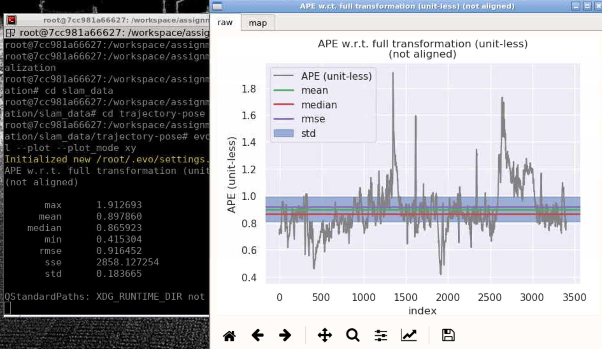

fused:

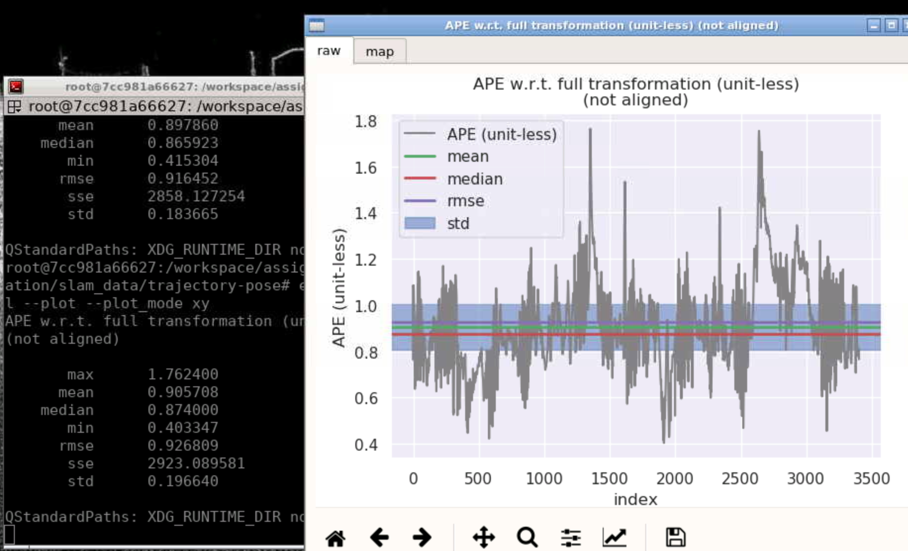


2. fusion_strategy: pose-vel

   laser:

   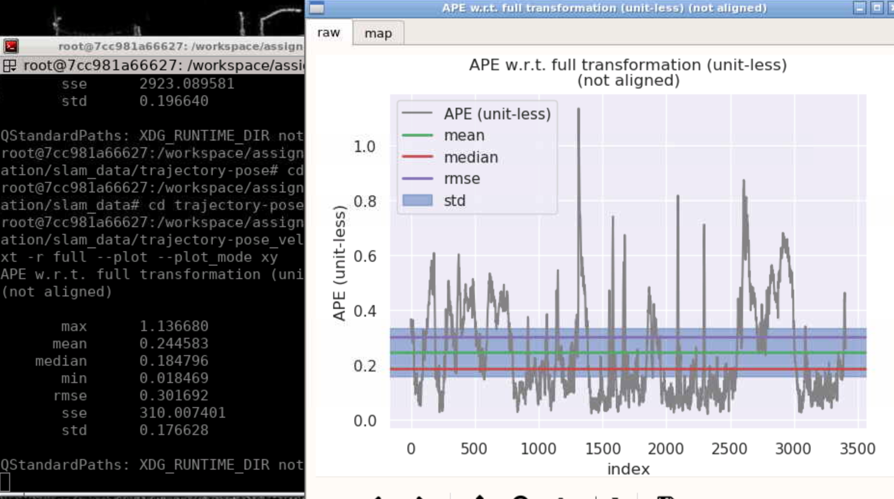

   fused:

   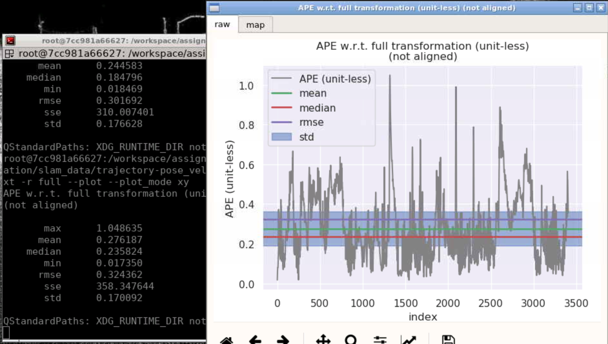

实验结论：融合后效果对比结论与上一章的基本一致，即误差的最大值，最小值以及标准差会有所减少，更多的是消除抖动带来的干扰。

3. fusion_strategy: posi

laser:

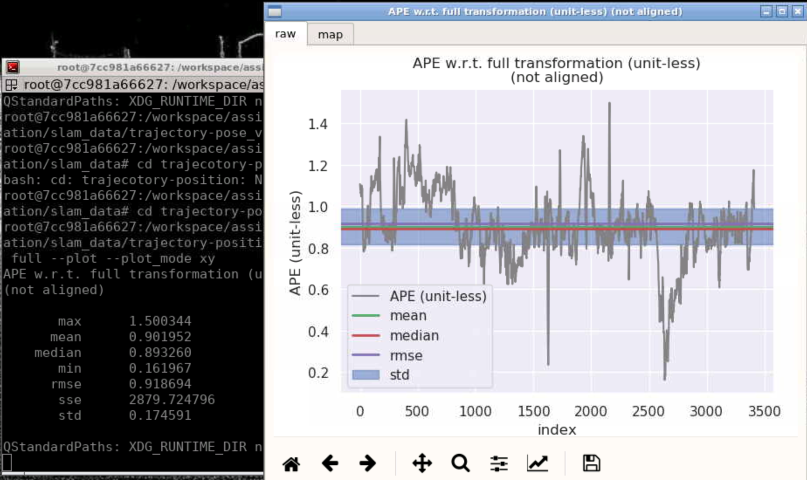

fused:

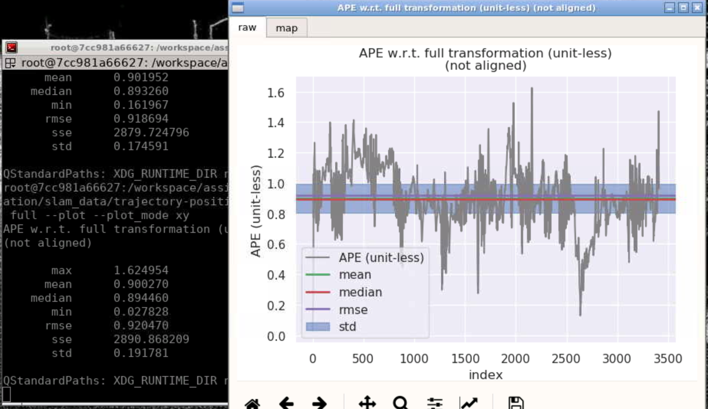


4. fusion_strategy: posi-vel

   laser:

   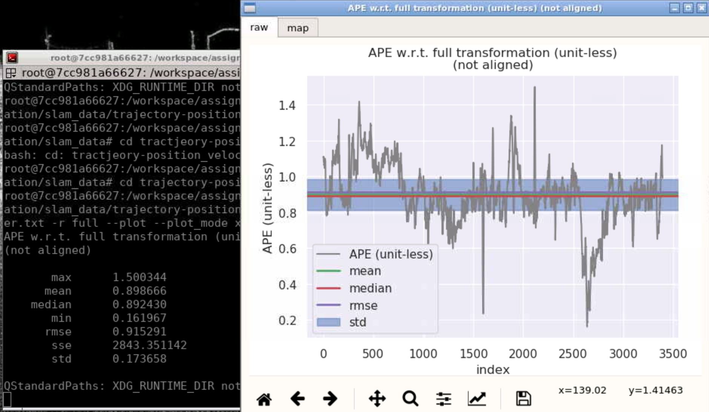

   fused:

   

实验结论：结论基本痛pose对比实验的一致。

### pose：

从下面的对比结果不论是Y向还是Z向增加了速度观测后，其效果误差都比之前的要好，但是Z向的效果更明显，说明融合后的效果确实可以消除一些抖动带来的干扰。

Y向：

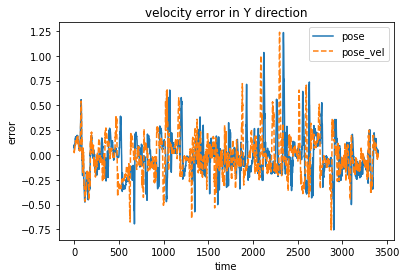

Z向：

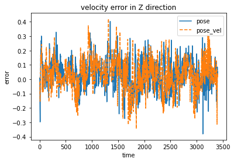

数据：

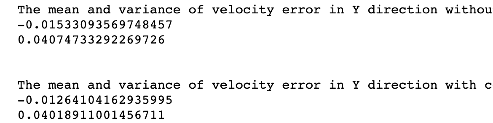

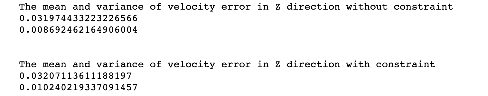

### posi:

 同上面的结论基本一致，从下面的对比结果不论是Y向还是Z向增加了速度观测后，其效果误差都比之前的要好，但是Z向的效果更明显。

Y向：

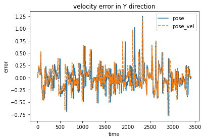

Z向：

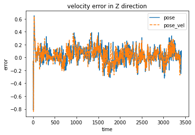

误差数据

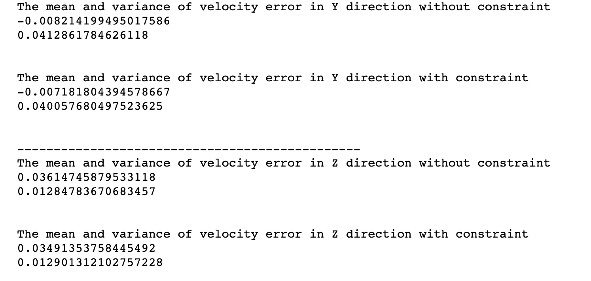

## 进阶部分

使用gnss_ins_sim生成仿真数据，并运行gnss_ins_sim_localization.launch，检测B系下的融合前后的精度对比

gnss:

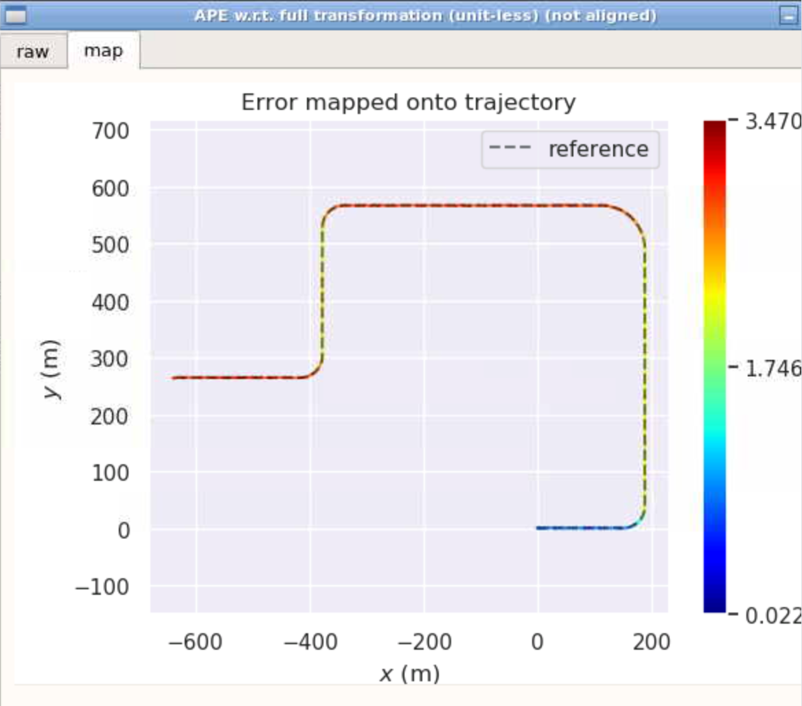

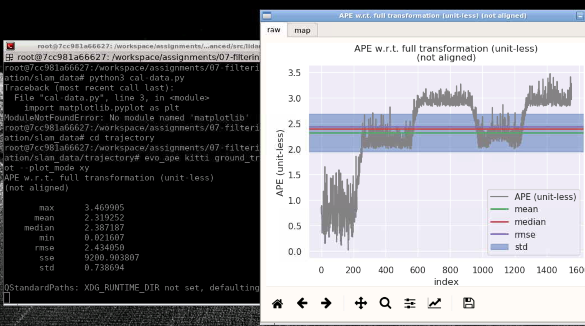

加入速度观测：

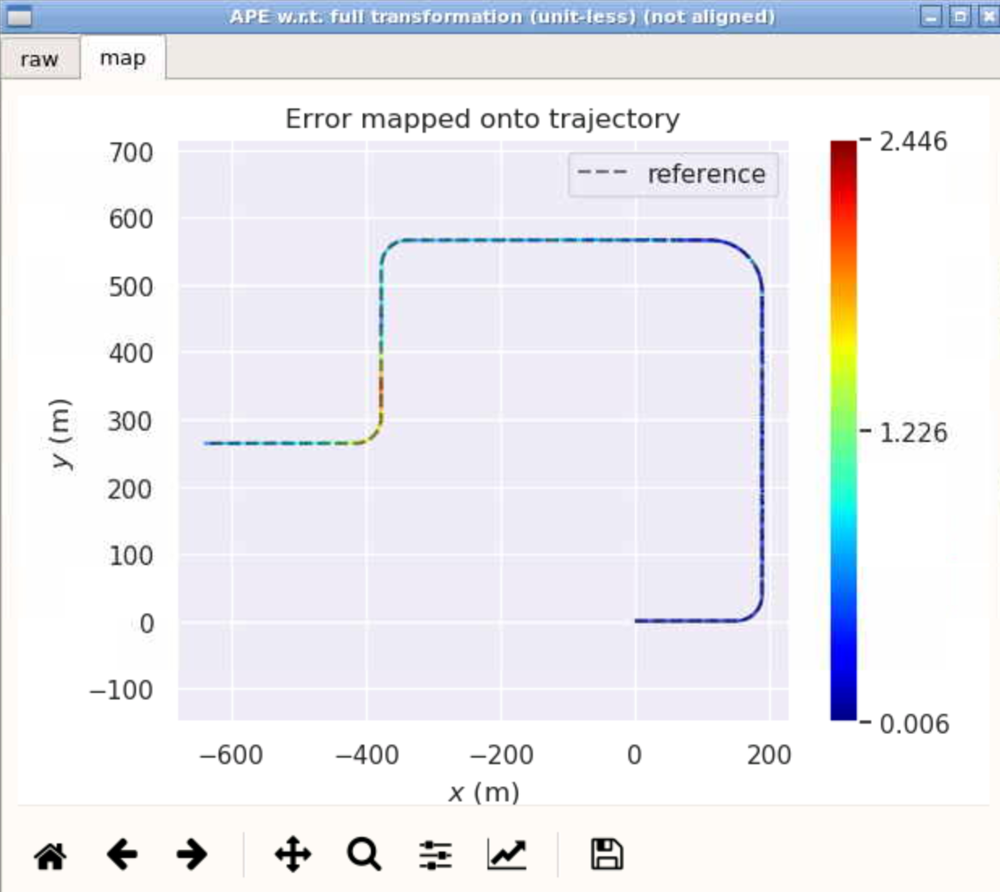

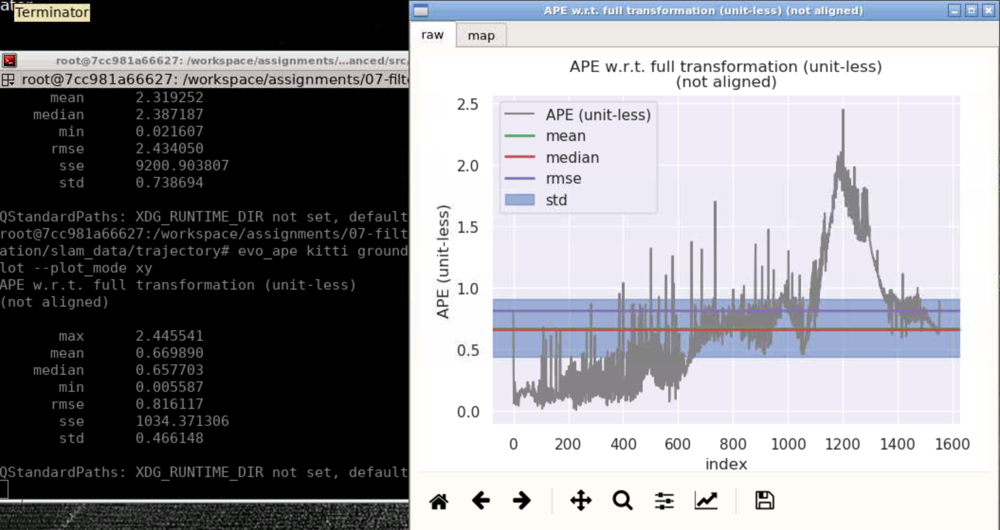

实验结论：通过对上面的两次实验的方差等对比可以看出：加入编码器速度观测后的融合方法基本在均值、中位数、最大值、标准差、累计误差等各个数据上都比GNSS的要好，尤其是累计误差从GNSS的9200下降到了1034，其在消除累计误差方面贡献更大。