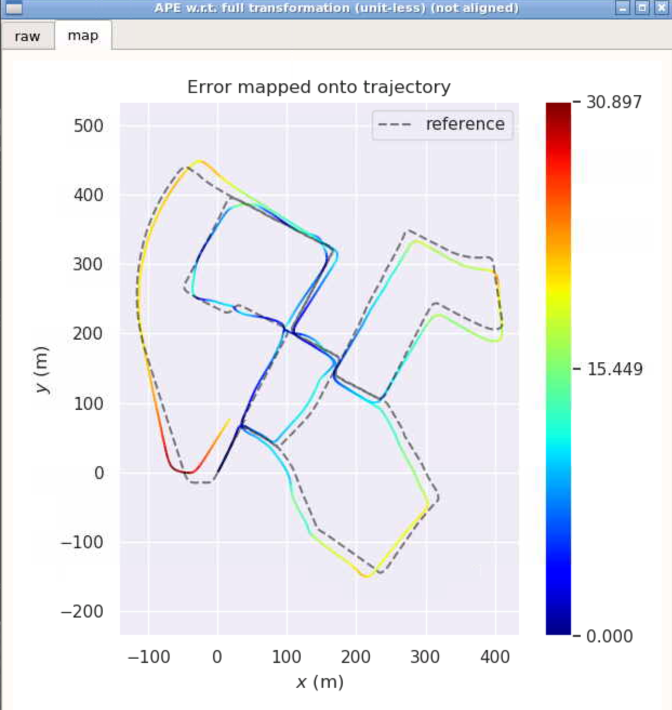
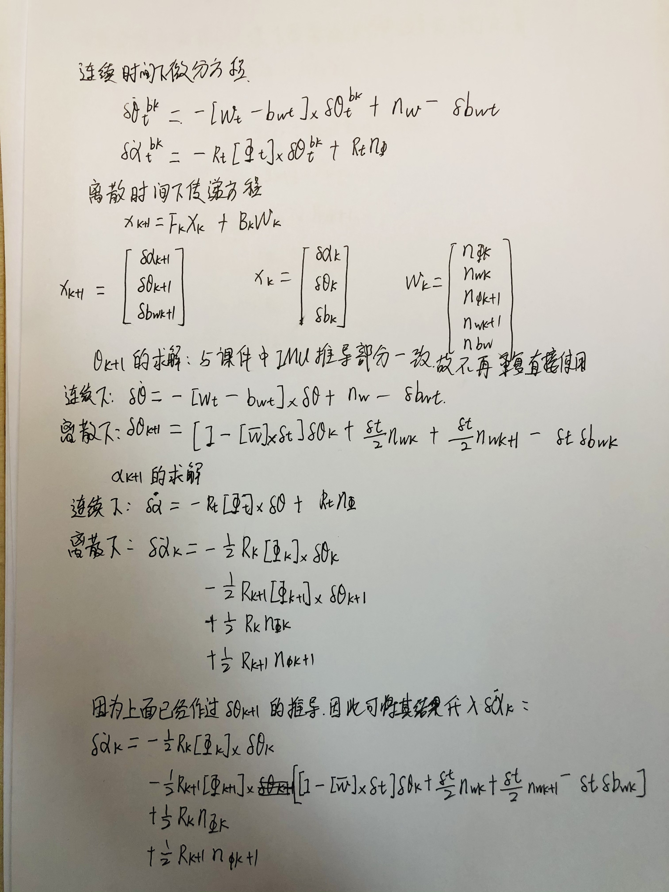
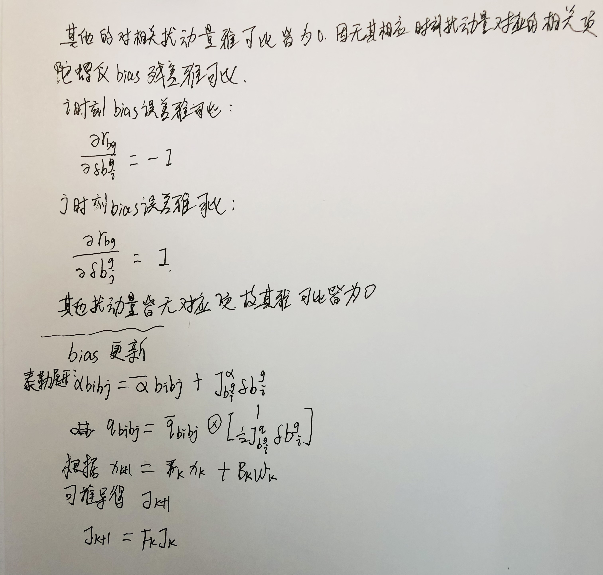

# Sensor Fusion: Lidar Odometry -- 多传感器融合定位与建图: 基于图优化的建图方法

深蓝学院, 多传感器融合定位与建图, 第9章Graph Optimization for Mapping代码框架.

---

## Overview

本作业旨在加深对**基于图优化的建图方法**的理解.

在IMU的预积分中, 课程只提供了残差对部分变量的雅可比, 请推导残差对其它变量的雅可比, 并在建图流程的代码中补全基于IMU预积分的融合方法中的待填内容，随后与不加IMU融合时的效果进行对比.

---

## 基础部分

**概述：**首先参考老师上课PPT里给的部分雅克比推到，把剩下的部分也写了，这一部分见代码里。然后把课程发布的框架里的TODO填充完，代码理论上就可以跑起来了，但是还有很多BUG，有点是公式对应错了，有点是指针指向错误，bug都修理掉，终于能跑起来了，最后看跑出的结果imu预积分的优化效果跟只有激光雷达预积分的效果差不多，误差的最大值，标准差等参数相比只有激光雷达预积分的还是要弱一些，后续还需迭代。第三次迭代后，修改了残差更新部分，优化的结果中终于有一项标准差优于激光的，其他的都暂时弱于激光的。

---

**参考资料：**

论文《On-Manifold Preintegration for Real-TimeVisual-Inertial Odometry》

VINS-Mono,使https://github.com/HKUST-Aerial-Robotics/VINS-Mono

---

### 没有IMU

此时，优化前后的结果相同，这里主要是用于后续对比。

轨迹图：

误差图：

---

### 加IMU，解析求倒

laser_odom：

轨迹图：

误差图：

optimized:

轨迹图：

误差图：

**实验结论：**通过对比来两次实验的轨迹误差可以看出加IMU后的优化效果反而更差，尤其是在转弯的时候，从轨迹图上就可以看出，在中间部分转了一个圈，使得它的最大误差达到了92,而同期的激光雷达优化最大误差才是29；此其一，其二，在轨迹图的下半部分可以看出其给出的结果有点像波浪线，跟轨迹参考存在较大差异，于是回溯，发现雅克比部分对于角度的求解有一处写错了，跟公式不一样。修正后的实验结果如下：

laser_odom:

轨迹图：

误差图：

optimized:

轨迹图：

误差图：

**实验结论：**从修正后的对比结果来看，加入IMU后的优化与只有激光雷达的优化效果基本接近，但是仍然小幅落后于只有激光雷达的优化时的指标。误差的最大值和标准差最明显。laser_odom误差的最大值为23.76,标准差为6.595, 而加入IMU后的优化对应的误差最大值和标准差分别是：24.0, 6,997

说明现在的解析求倒的优化还有一定的提神空间。从误差图的右半部分来看，加如IMU后的优化在行程的后半部分与lidar_odom的结果基本一致，而前半部分则存在这较大差异，且从轨迹图可以看出其仍然存在一定程度的波浪型翻褶，这说明后台的优化在这一部分出现了断代，因为IMU自身是惯性器件，其积分输出值也应该是连续平滑的曲线。然后观察后台输出的log信息也证实了这一点，原以为是播放速度太快计算跟不上导致的，后来放慢了播放速度依然存在上述问题，看来程序还是有一些小问题，后续还需改进。

### 改进：

对残差更新公式进行了修正，原来的有一点问题。之后得到的结果如下所示：

laser_odom:

轨迹图：

误差图：

optimized:

轨迹图：

误差图：

结论：从上面的laser和optimized的对比来看，这次比之前又有了一些进步，optimized之后的标准差为6.56,小于laser的标准差7.32，其他的指标仍然落后与laser的，还有就是在最后的结果上看到，optimized过的数据中间有一些的轨迹是断开的，出现了跳跃，这个仍然是存在的问题之一，个人认为是在那些地方没有解出值，可能出现了奇异值，也可能是地图的问题。后面在做实验寻找答案吧。

---

## 升级部分

融合编码预积分公式的推倒：

编码器与IMU基于预积分的融合有多种方法,此处选相对简单的一种:
把它们当做一个整体的传感器来用,IMU提供角速度,编码器提供位移增量,且不考虑编码器的误
差。

状态更新公式和残差形式如下图所示：

**方差递推部分：**

**续**：

**雅克比推导和Bias更新：**

**续**：

