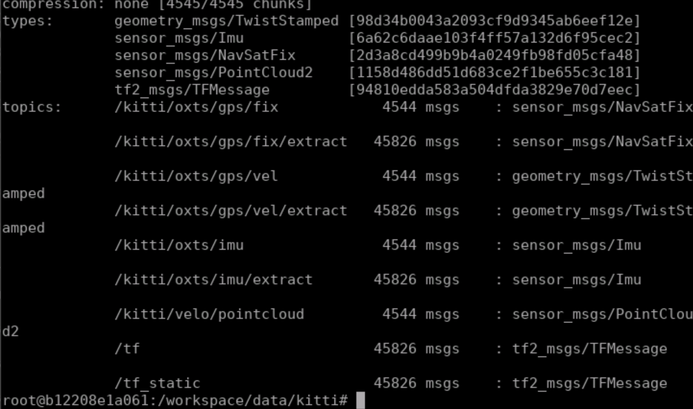
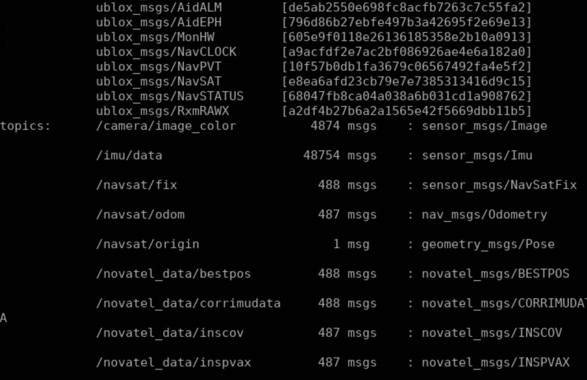
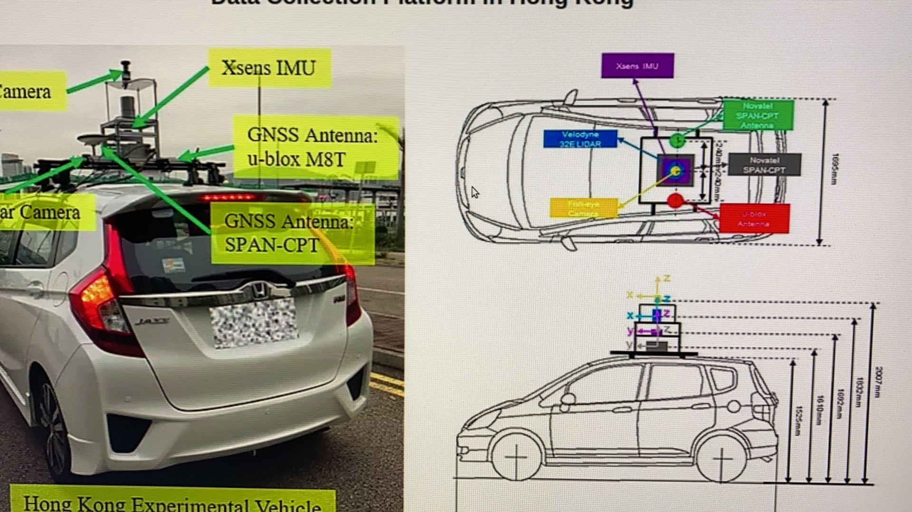
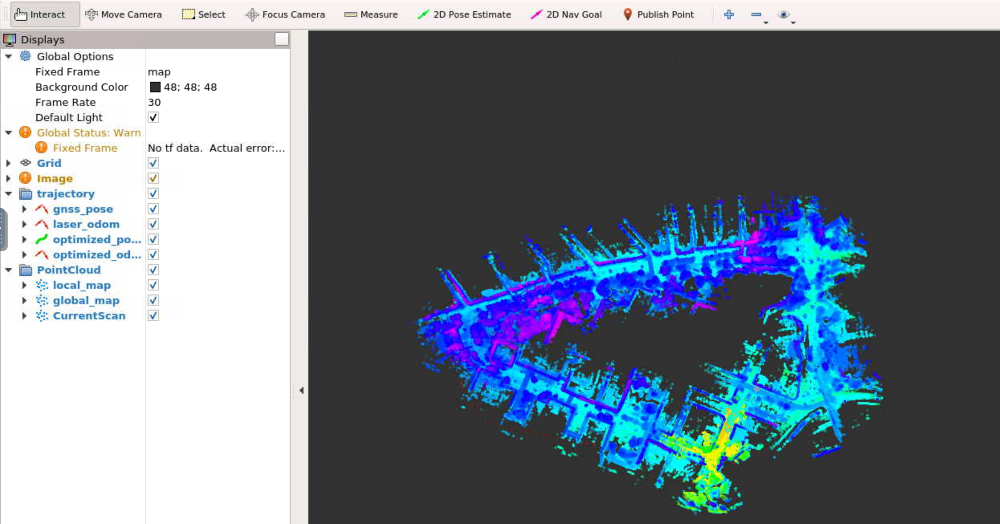
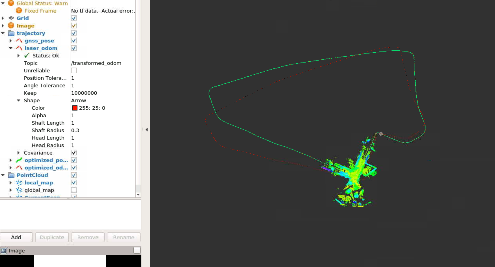
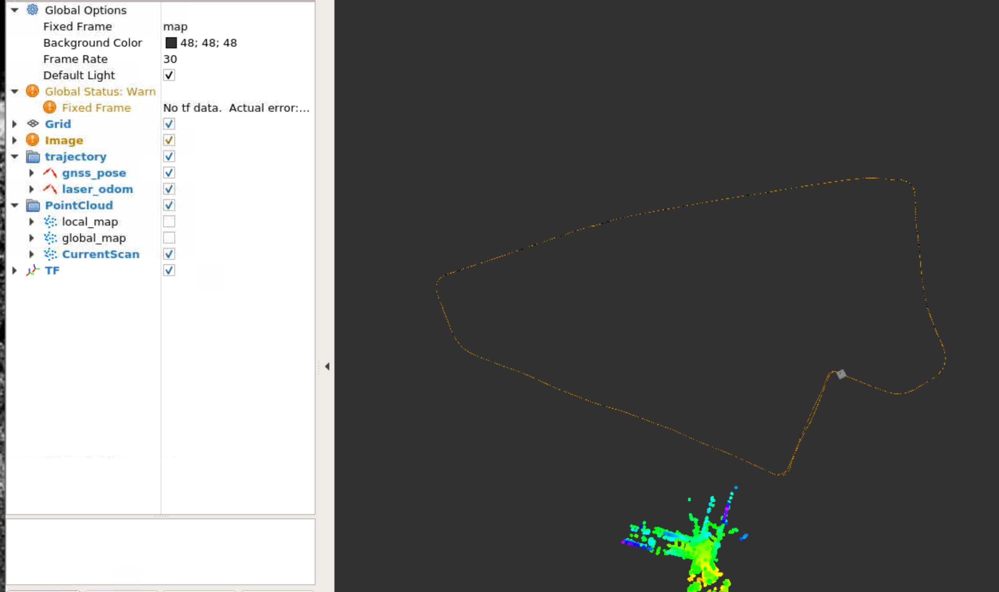
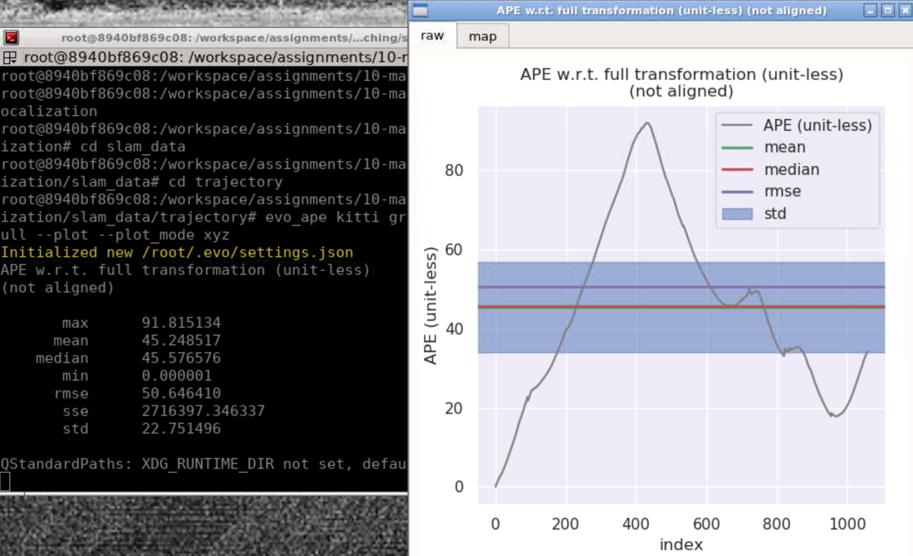
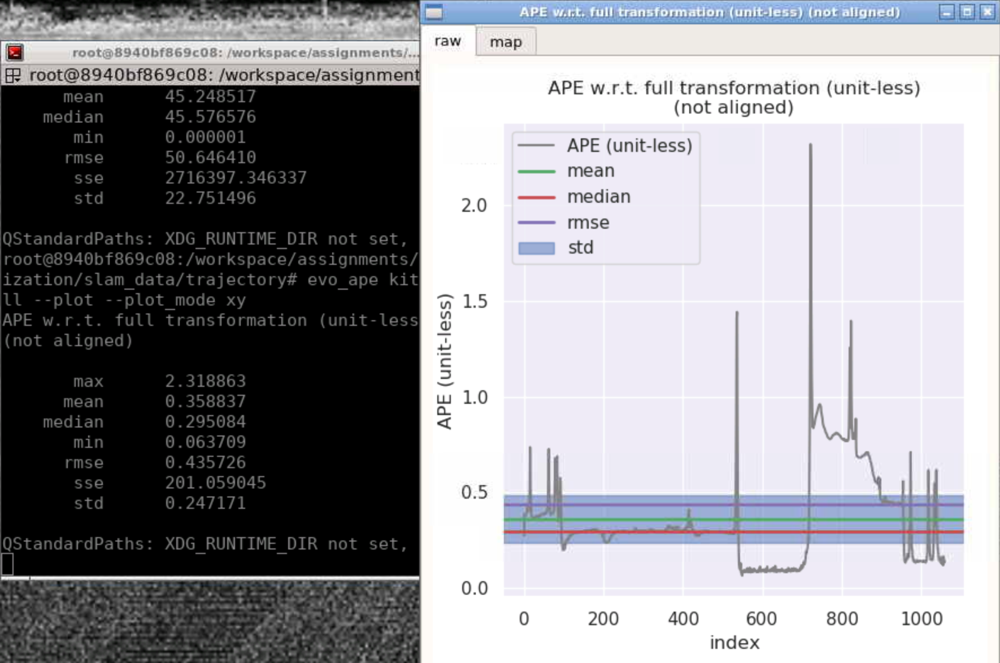
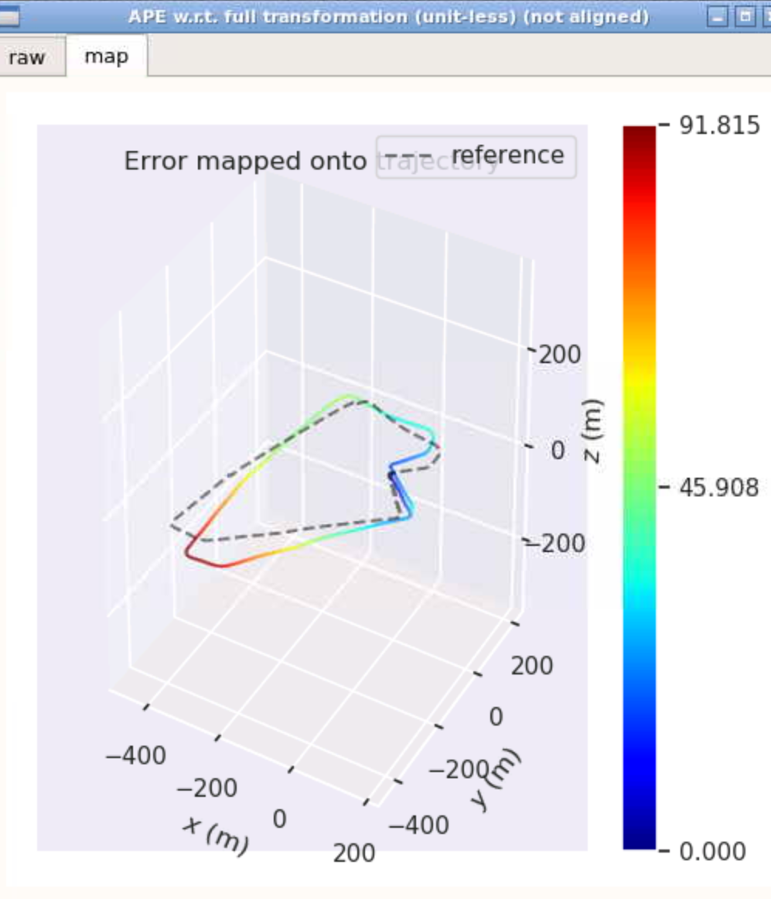
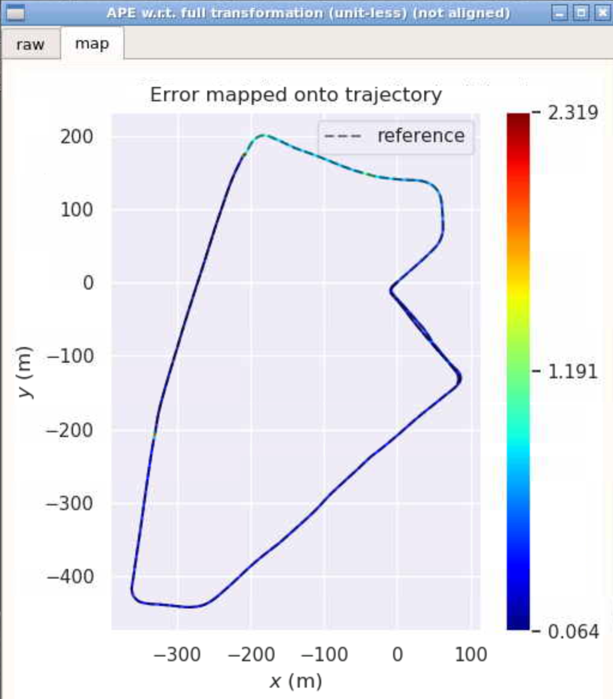

# Project

## topic更改

原来的kitii数据集集成了TF监听模块



新的数据集：



但是新的数据集并没有这一模块，导致原来读取kitti数据集的程序就无法与新的数据集匹配，要么重新写yaml，要么不用监听，直接读取。由于新的数据集里没有速度的数据，根据助教的提供的方法，可以通过雷达里成计获得也可以对相邻的两帧GNSS数据求差分。这一部分暂时没有做。

还有一个问题，就是雷达和IMU的X轴方向不一样，差90度，我测试了几组参数X轴方向对了，Y的又出错了，就按原来的参数进行。



```bash
#作者github中lidar和imu的转换关系矩阵
body_T_LiDAR: !!opencv-matrix
   rows: 4
   cols: 4
   dt: d
   data: [ 2.67949e-08, -1,  0, 0,
           1,  2.67949e-08,  0, 0,
           0,  0,  1, -0.28, 
           0., 0., 0., 1 ]
```

解析novatel_data数据集，需要安装对应的msg

在docker下的ubuntu中安装：需要先update一下apt-get

sudo apt-get  install ros-kinetic-novatel-msgs

kinetic是自己的ros对应的版本。

## 代码修改

代码修改：data_pretreat_flow.cpp

```bash
#原来的topic
DataPretreatFlow::DataPretreatFlow(ros::NodeHandle& nh, std::string cloud_topic) {
    // subscriber
    // a. velodyne measurement:
    cloud_sub_ptr_ = std::make_shared<CloudSubscriber>(nh, "/kitti/velo/pointcloud", 100000);
    // b. OXTS IMU:
    imu_sub_ptr_ = std::make_shared<IMUSubscriber>(nh, "/kitti/oxts/imu", 1000000);
    // c. OXTS velocity:
    velocity_sub_ptr_ = std::make_shared<VelocitySubscriber>(nh, "/kitti/oxts/gps/vel", 1000000);
    // d. OXTS GNSS:
    gnss_sub_ptr_ = std::make_shared<GNSSSubscriber>(nh, "/kitti/oxts/gps/fix", 1000000);
    lidar_to_imu_ptr_ = std::make_shared<TFListener>(nh, "/imu_link", "/velo_link");
```


```bash
#新的topic
DataPretreatFlow::DataPretreatFlow(ros::NodeHandle& nh, std::string cloud_topic) {
    // subscriber
    // a. velodyne measurement:
   // done
    cloud_sub_ptr_ = std::make_shared<CloudSubscriber>(nh, "/velodyne_points", 100000);
    // b. OXTS IMU:
    imu_sub_ptr_ = std::make_shared<IMUSubscriber>(nh, "/imu/data", 1000000);
    // c. OXTS velocity:
    //done
   // velocity_sub_ptr_ = std::make_shared<VelocitySubscriber>(nh, "/kitti/oxts/gps/vel", 1000000);
    // d. OXTS GNSS:
    //done
    gnss_sub_ptr_ = std::make_shared<GNSSSubscriber>(nh, "/navsat/fix", 1000000);
    lidar_to_imu_ptr_ = std::make_shared<TFListener>(nh, "/imu_link", "/velo_link");

```

同时把代码中涉及到速度的都注释掉，剩下的就是时间同步问题了

kitti的数据中,gnss和imu的数据频率都是10hz,urbannav中的gnss数据是1hz,点云数据为10hz,imu为100hz时间同步相关的参数有两个,一个是data_pretreat_flow.cpp 中函数
ValidData()中的0.05,应选用点云数据周期的一半,这里不需要更改。
另一个是gnss_data.cpp 和imu_data.cpp 中数据同步函数 SyncData 中的参数 0Hz.2,这里的物理意义是相应数据周期的 2倍,所以分别修改为 2 和 0.2Hz和0.2Hz。

gnss_data.cpp中修改为:

```bash
bool GNSSData::SyncData(std::deque<GNSSData>& UnsyncedData, std::deque<GNSSData>& SyncedData, double sync_time) {
    // 传感器数据按时间序列排列，在传感器数据中为同步的时间点找到合适的时间位置
    // 即找到与同步时间相邻的左右两个数据
    // 需要注意的是，如果左右相邻数据有一个离同步时间差值比较大，则说明数据有丢失，时间离得太远不适合做差值
    while (UnsyncedData.size() >= 2) {
        if (UnsyncedData.front().time > sync_time)
            return false;
        if (UnsyncedData.at(1).time < sync_time) {
            UnsyncedData.pop_front();
            continue;
        }
        if (sync_time - UnsyncedData.front().time > 0.2) {
            UnsyncedData.pop_front();
            return false;
        }
        if (UnsyncedData.at(1).time - sync_time > 0.2) {
            UnsyncedData.pop_front();
            return false;
        }
        break;
    }
    if (UnsyncedData.size() < 2)
        return false;
```

imu_data.cpp中修改为:

```bash
bool IMUData::SyncData(std::deque<IMUData>& UnsyncedData, std::deque<IMUData>& SyncedData, double sync_time) {
    // 传感器数据按时间序列排列，在传感器数据中为同步的时间点找到合适的时间位置
    // 即找到与同步时间相邻的左右两个数据
    // 需要注意的是，如果左右相邻数据有一个离同步时间差值比较大，则说明数据有丢失，时间离得太远不适合做差值
    while (UnsyncedData.size() >= 2) {
        // UnsyncedData.front().time should be <= sync_time:
        if (UnsyncedData.front().time > sync_time) 
            return false;
        // sync_time should be <= UnsyncedData.at(1).time:
        if (UnsyncedData.at(1).time < sync_time) {
            UnsyncedData.pop_front();
            continue;
        }

        // sync_time - UnsyncedData.front().time should be <= 0.2:
        if (sync_time - UnsyncedData.front().time > 0.2) {
            UnsyncedData.pop_front();
            return false;
        }
        // UnsyncedData.at(1).time - sync_time should be <= 0.2
        if (UnsyncedData.at(1).time - sync_time > 0.2) {
            UnsyncedData.pop_front();
            return false;
        }
        break;
    }
    if (UnsyncedData.size() < 2)
        return false;
```

重力等其他外参暂时没校正，先把原来的框架跑了起来。

## 上机实验

这里先跑通的是第三章的mapping-and-matching部分。

下图是见图部分：



全局轨迹：



里程计和GNSS确实差了很多，偏移较大。

优化之后的结果如下：

开始时候：


全局轨迹：



相对于未优化的结果确实进步了很多。有明显的提升。

## **evo评估**的轨迹

优化前后的误差参数对比如下所示：

|              | 优化前                            | 优化后                      |
| ------------ | --------------------------------- | --------------------------- |
| 误差参数对比 |    |    |
| 轨迹误差对比 |  |  |

结论：最大值从91.8下降到2.3,均值从45.2下降到0.36,  从误差数据对比来看优化的效果非常明显。

由于毕业季需要写论文，PPT，答辩等事情较多，其他的程序暂时没有时间去一一验证。但是这个跑通了，基础问题已经解决掉了，后面的有时间再补上。